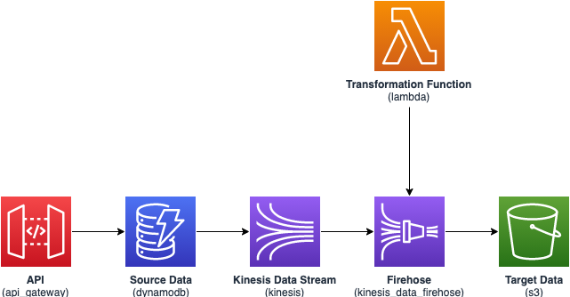

# DynamoDB ingestion into S3 with Kinesis Data Streams and Kinesis Data Firehose	
<!--BEGIN STABILITY BANNER-->
---


> **This is an experimental example. It may not build out of the box**
>
> This example is built using Construct Libraries marked "Experimental" and may not be updated for latest breaking changes.
>
> If build is unsuccessful, please create an [issue](https://github.com/aws-samples/aws-dynamodb-kinesisfirehose-s3-ingestion/issues/new) so that we may debug the problem 

---
<!--END STABILITY BANNER-->
| **Language**     | **Package**        |
|:-------------|-----------------|
| Typescript|[aws-dynamodb-kinesisstreams-s3](https://www.npmjs.com/package/aws-dynamodb-kinesisstreams-s3)|

This a sample AWS CDK application that delivers Amazon DynamoDB records to an S3 bucket using Amazon Kinesis Data Streams and Kinesis Data Firehose.

## Build
To install and build the latest code in `pattern/aws-dynamodb-kinesisstreams-s3` and `sample-application` folders:

```bash
npm install -g aws-cdk

cd pattern/aws-dynamodb-kinesisstreams-s3
npm install
npm run build

cd sample-application
npm install
npm run build
```

This will install the AWS CDK client, install/build the AWS CDK L3 construct `aws-dynamodb-kinesisstreams-s3` and finally install/build the sample application under `sample-application`.

## Synthesize Cloudformation Template

To see the Cloudformation template generated by the CDK, run `cdk synth` in the sample-application folder, then check the output file in the "cdk.out" directory.

```bash
cdk synth
cdk bootstrap
```

## Deploy

Run `cdk deploy`. This will deploy / redeploy your Stack to your AWS Account.

```bash
cd sample-application
cdk deploy
```

## Test

Sample app creates a Rest API `SourceData Service` with a `post` method. Send a test event:

- Sample event body : 
```json
{"data": "{'CardID':'defaultname','Image':'defaulturl'}"}
```

- Sample event body : 
```json
{"data": "[{'CardID':'defaultname','Image':'defaulturl'},{'CardID':'defaultname','Image':'defaulturl'},{'CardID':'defaultname','Image':'defaulturl'},{'CardID':'defaultname','Image':'defaulturl'},{'CardID':'defaultname','Image':'defaulturl'}]"}
```

After the deployment CDK will output the API Gateway URL endpoint to be used for testing.

## Architecture




This sample application provisions:

#### Amazon API Gateway
- Deploy an edge-optimized API endpoint
- Enable CloudWatch logging for API Gateway
- Configure least privilege access IAM role for API Gateway
- Set the default authorizationType for all API methods to IAM
- Enable X-Ray Tracing

#### Amazon DynamoDB Table
- Set the billing mode for DynamoDB Table to On-Demand (Pay per request)
- Enable server-side encryption for DynamoDB Table using AWS managed KMS Key
- Creates a partition key called 'id' for DynamoDB Table
- Retain the Table when deleting the CloudFormation stack
- Enable continuous backups and point-in-time recovery

#### Amazon Kinesis Stream
- Configure least privilege access IAM role for Amazon Kinesis Stream
- Enable server-side encryption for Amazon Kinesis Stream using AWS Managed KMS Key
- Deploy best practices CloudWatch Alarms for the Amazon Kinesis Stream

#### Amazon Kinesis Firehose
- Enable CloudWatch logging for Amazon Kinesis Firehose
- Configure least privilege access IAM role for Amazon Kinesis Firehose

#### Amazon S3 Bucket
- Configure Access logging for Amazon S3 Bucket
- Enable server-side encryption for Amazon S3 Bucket using AWS managed KMS Key
- Enforce encryption of data in transit
- Turn on the versioning for Amazon S3 Bucket
- Don't allow public access for Amazon S3 Bucket
- Retain the Amazon S3 Bucket when deleting the CloudFormation stack
- Applies Lifecycle rule to move non-current object versions to Glacier storage after 90 days

#### AWS Lambda Function
- Configure limited privilege access IAM role for AWS Lambda function
- Enable X-Ray Tracing
- Set Environment Variables
- AWS_NODEJS_CONNECTION_REUSE_ENABLED (for Node 12.x and higher functions)
